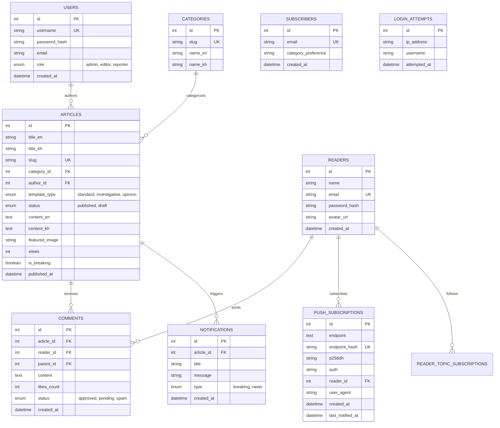

# NewsPlatform CMS


A production-grade, decoupled **Content Management System (CMS)** and **Content Delivery Application (CDA)** engineered for independent journalism, digital newsrooms, and editorial publishing platforms. Built with pure PHP 8.2+, MySQL, modular security layers, custom multi-template layout blueprints, RFC 8292 VAPID Web Push notifications, PWA service worker caching, seamless bilingual Khmer/English support, and a complete reader authentication system.

---

> 🎓 **Student & Presentation Summary (Quick Guide for Class):**
>
> This web application is a full-featured **News Publishing Platform** (similar to BBC News, CNA, or Fresh News). It is divided into two decoupled operational environments:
>
> 1. **🌐 Public Reader Website (CDA - Content Delivery Application)**: Located under `/public`. Allows readers to browse breaking news, switch between Khmer & English languages instantly without page reloads, bookmark articles into an offline reading list, preview summaries via quick popups, subscribe to push notifications, and read full long-form articles across 3 specialized layout blueprints.
> 2. **🔐 Backend Admin Panel (CMA - Content Management Application)**: Located under `/public/admin`. A secure management dashboard for administrators, editors, and reporters to draft/publish articles, manage categories, upload media with MS Word-style text wrapping, track user permissions, and handle email subscriptions.

---

## 💡 Quick Reference Card for Beginners

| Topic | Details & Instructions |
| :--- | :--- |
| 🌐 **Public Reader Website** | `http://localhost/News-platform-1/public/` |
| 🔐 **Admin Login Portal** | `http://localhost/News-platform-1/public/admin/login.php` |
| 🔑 **Default Admin Account** | **Username:** `admin` \| **Password:** `admin123` *(Full Control)* |
| 🔑 **Default Editor Account** | **Username:** `eleanor_vane` \| **Password:** `admin123` *(Editing & Publishing)* |
| 🔑 **Default Reporter Account**| **Username:** `reporter` \| **Password:** `admin123` *(Drafting & Media Upload)* |
| 🗄️ **Database Auto-Setup** | **Automatic!** Database schema, tables, and sample news articles auto-initialize on first page load. |
| 🔔 **Push Notification Setup** | Visit `http://localhost/News-platform-1/public/setup-push.php?secret=setup2024` once to initialize DB table, then click "Enable Notifications" in the app. |

---

## 📋 Table of Contents

- [💡 Quick Reference Card for Beginners](#-quick-reference-card-for-beginners)
- [✨ Key System Features](#-key-system-features)
- [💻 Prerequisites & Technical Stack](#-prerequisites--technical-stack)
- [🚀 Quick Installation & Setup Guide](#-quick-installation--setup-guide)
- [🔔 Push Notification Setup Guide](#-push-notification-setup-guide)
- [🔑 Role-Based Access Control (RBAC) & Credentials](#-role-based-access-control-rbac--credentials)
- [⚙️ Deep-Dive Architecture & Core Components](#️-deep-dive-architecture--core-components)
  - [1. Decoupled Webroot Isolation (CMA vs CDA)](#1-decoupled-webroot-isolation-cma-vs-cda)
  - [2. Bridge Script Delegation Pattern](#2-bridge-script-delegation-pattern)
  - [3. Core Classes & Engine Breakdown](#3-core-classes--engine-breakdown)
  - [4. Centralized Bilingual Engine (Khmer & English)](#4-centralized-bilingual-engine-khmer--english)
  - [5. Floating Toast Notification Engine](#5-floating-toast-notification-engine)
  - [6. Multi-Template Layout Blueprints](#6-multi-template-layout-blueprints)
  - [7. MS Word-Style Media Shortcodes & Text Wrapping](#7-ms-word-style-media-shortcodes--text-wrapping)
  - [8. Interactive Saved Reading List & Offcanvas Drawer](#8-interactive-saved-reading-list--offcanvas-drawer)
  - [9. Quick Article Preview Modal](#9-quick-article-preview-modal)
  - [10. Web Push API (RFC 8292 VAPID)](#10-web-push-api-rfc-8292-vapid)
  - [11. Progressive Web App (PWA)](#11-progressive-web-app-pwa)
- [📁 Comprehensive Directory Structure](#-comprehensive-directory-structure)
- [🗄️ Database Relational Schema](#️-database-relational-schema)
- [🌟 Recent Platform Enhancements & Changelog](#-recent-platform-enhancements--changelog)
- [🚀 Future Enhancements & Roadmap](#-future-enhancements--roadmap)
- [❓ Troubleshooting & FAQ](#-troubleshooting--faq)

---

## ✨ Key System Features

- 📰 **BBC / CNA Flat Editorial Aesthetic**: Clean, high-contrast light mode with signature crimson red accents (`#c8102e`), dark navy headings (`#0f172a`), flat sharp borders (`#e5e7eb`), and zero box-shadow elevation for maximum readability.
- 🌐 **Zero-Reload Dual-Language Engine (Khmer & English)**: Instant language switching via seamless AJAX content swapping — zero page refresh. The active language is preserved across sessions. Translation keys cover all UI labels, navigation, buttons, dates, and push notification messages.
- 🔔 **True Background Web Push Notifications (RFC 8292 VAPID)**: Full implementation of RFC 8292 Voluntary Application Server Identification with ES256 JWT, RFC 8291 AES-128-GCM payload encryption, `push_subscriptions` database table, parallel cURL broadcast, and automatic expired-subscription pruning. Notifications fire on all subscribed devices even when the app is closed.
- 📱 **Progressive Web App (PWA) — Service Worker v3**: Installable on phone and PC home screen. Offline cache strategy with `stale-while-revalidate`, forced SW update on installed devices via `reg.update()`, and a dedicated offline fallback page (`offline.html`).
- 👤 **Complete Reader Authentication System**: Isolated reader registration and login (`/register.php`, `/login.php`) operating independently from staff sessions. Supports avatar URLs, reader profile editing, password change, topic subscriptions, and danger-zone account deletion.
- 💬 **AJAX-First Comments & Auth — No Page Reloads**: Comment submission, login, and registration all use `fetch()` with strict `X-Requested-With` + `Accept: application/json` AJAX headers. Non-AJAX POSTs redirect gracefully (fixes raw JSON appearing in installed PWA).
- 🔐 **Enforced Password Security Policy**: Strict minimum 8-character password validation enforced on both PHP backend controllers and client-side forms for all staff creation and account updates.
- 🖼️ **Dual Main Cover Image Sourcing**: Support for direct web image URLs (Unsplash, Cloudflare CDN) alongside local file uploads (JPG, PNG, WEBP max 5MB), backed by automatic DB schema migration (`VARCHAR(500)`).
- 📱 **Device-Adaptive Aspect Ratio & Image Protection**: Responsive CSS `object-fit: cover; object-position: center;` layout protection with max-height guards (`380px` desktop, `280px` tablet, `220px` mobile) ensuring zero image clipping or distortion across all viewports.
- 🔔 **Context-Aware Floating Toast Notifications**: Custom `window.showAdminToast()` system with floating auto-dismiss status cards positioned neatly below the navigation bar. Displays real-time feedback for published articles, saved drafts, field validation warnings, and errors.
- 👥 **3-Tier Role-Based Access Control (RBAC)**: Granular permission levels enforcing strict authorization across `admin`, `editor`, and `reporter` roles.
- 📝 **Article Publishing & Draft Workflow**: Save as drafts or publish immediately, with status tags and filter tabs in the admin dashboard.
- 🔖 **Account-Gated Saved Reading List**: Readers must be logged in to bookmark articles. Stored in `localStorage` with live header counter badge and an offcanvas drawer with one-click removal.
- 👁️ **Quick Article Preview Modal**: AJAX-powered modal pop-up enabling readers to view summaries, author metadata, publication dates, view counts, and reading times directly from the feed.
- 📐 **3 Custom Article Layout Blueprints**:
  - `Standard`: Classic 2-column editorial layout with sticky sidebar and author spotlight card.
  - `Investigative`: Single-column deep-read view with dark hero banner and verified primary citation callout boxes.
  - `Opinion`: Columnist avatar header spotlight, styled red-bordered pull quotes, and reader commentary box.
- 🖼️ **MS Word-Style Media Shortcodes**: Floating media alignment tags (`[image:1:left]`, `[image:1:right]`, `[video:1:full]`) allowing text to wrap naturally around images and videos.
- 📊 **Reading Progress Bar**: Dynamic top scroll progress bar tracking long-form reading depth in real time.
- 💬 **Threaded Community Discussions**: Production-grade threaded comment system with nested parent/child replies, dynamic like counter, avatar initials, Khmer/English support across all 3 article blueprints.
- 📈 **Visual Analytics Dashboard (Chart.js)**: 6 high-level KPI cards, Category Readership Distribution bar chart, Top Stories leaderboard, and 30-day traffic impressions.
- 🌐 **Decoupled RESTful Public API v1**: Clean JSON endpoints (`/api/v1/articles`, `/api/v1/categories`, `/api/v1/comments`, `/api/v1/notifications`, `/api/v1/push-subscription`, `/api/v1/subscription`) with full-text search, pagination, CORS compliance, and authentication guarding.
- ⚡ **Auto Database Schema Initialization & Seeder**: Self-healing database handler that automatically creates all tables and seeds default data upon initial load.

---

## 💻 Prerequisites & Technical Stack

### Server Environment Requirements

| Component | Minimum Requirement | Recommended | Notes |
| :--- | :--- | :--- | :--- |
| **Web Server** | Apache 2.4+ | XAMPP / WAMP / Laragon | `mod_rewrite` enabled for clean routing |
| **PHP Engine** | PHP 8.0+ | PHP 8.2 or 8.3 | Required extensions: `pdo`, `pdo_mysql`, `gd`, `session`, `json`, `openssl`, `curl` |
| **Database** | MySQL 5.7+ | MySQL 8.0+ / MariaDB 10.3+ | UTF-8 (`utf8mb4_unicode_ci`) encoding |
| **Frontend Framework** | Bootstrap 5.3.2 | Loaded via CDN | Paired with Bootstrap Icons 1.11.0 |
| **OpenSSL** | 1.1.1+ | System-bundled with XAMPP | Required for VAPID EC key generation and AES-GCM encryption |
| **cURL** | Any | PHP ext-curl | Required for dispatching Web Push to browser vendor endpoints |

### Core Architecture Technologies
- **Backend**: Native Object-Oriented & Procedural PHP 8.2 (No external framework dependency).
- **Security**: Custom `Auth` singleton with `PASSWORD_BCRYPT` hashing, CSRF token protection, and `login_attempts` brute-force IP rate-limiting.
- **Sanitization**: Custom `Sanitizer` class featuring dual-layer XSS HTML stripping and shortcode parsing.
- **Push Encryption**: Custom `WebPush` class implementing RFC 8292 (VAPID ES256 JWT) + RFC 8291 (AES-128-GCM) from scratch using PHP `openssl_*` functions — no external Composer library required.
- **Frontend Interactivity**: Native JavaScript (ES6+) with Async/Fetch API, `localStorage`, and Service Worker API.

---

## 🚀 Quick Installation & Setup Guide

### Step 1: Copy Project to Apache `htdocs`
Copy or extract the project folder to your local Apache web server root directory:
- **XAMPP**: `C:\xampp\htdocs\News-platform-1\`
- **WAMP**: `C:\wamp64\www\News-platform-1\`
- **Laragon**: `C:\laragon\www\News-platform-1\`

### Step 2: Configure Database Credentials & Environment Variables
1. Open [config/database.php](file:///c:/xampp/htdocs/News-platform-1/config/database.php) and adjust your local MySQL credentials if needed.
2. Open [.env.example](file:///c:/xampp/htdocs/News-platform-1/.env.example) for reference when deploying to production environments like Render.
3. VAPID Web Push notification keys are pre-configured in [config/vapid.php](file:///c:/xampp/htdocs/News-platform-1/config/vapid.php) with environment variable fallbacks (`VAPID_PUBLIC_KEY`, `VAPID_PRIVATE_KEY`, `VAPID_SUBJECT`).
4. Local secret VAPID key overrides are stored in `config/vapid.local.php` and are protected by [.gitignore](file:///c:/xampp/htdocs/News-platform-1/.gitignore).

```php
// config/database.php
return [
    'host'     => 'localhost',
    'port'     => 3306,
    'dbname'   => 'news_platform',
    'username' => 'root',
    'password' => '', // Default empty password for XAMPP
    'charset'  => 'utf8mb4',
];
```

### Step 3: Automatic Database Schema Creation & Data Seeding
**No manual database imports are required!** Simply open the application in your web browser:
1. Navigating to `http://localhost/News-platform-1/public/` triggers `Database::autoInitializeSchema()`.
2. It automatically creates the `news_platform` database if it does not exist.
3. It creates all relational tables: `users`, `categories`, `articles`, `readers`, `comments`, `notifications`, `subscribers`, `push_subscriptions`, `login_attempts`, and `reader_topic_subscriptions`.
4. It seeds initial staff accounts (`admin`, `eleanor_vane`, `reporter`) and sample categories.

*(Optional: Visit `http://localhost/News-platform-1/seed_news.php` in your browser anytime to re-seed 12 fresh sample news stories.)*

---

## 🔔 Push Notification Setup Guide

True background Web Push notifications (show even when the app is fully closed) require a one-time setup:

### Step 1 — Create the `push_subscriptions` table
Visit this URL in your browser once:
```
http://localhost/News-platform-1/public/setup-push.php?secret=setup2024
```
This creates the `push_subscriptions` table if it doesn't exist, shows your VAPID key status, and confirms system readiness.

### Step 2 — Subscribe on each device
Open the app in your browser or installed PWA. Click the **🔔 bell / "Enable Notifications"** banner. The app will:
1. Request notification permission from the OS
2. Call `pushManager.subscribe()` with the VAPID public key
3. Save the browser endpoint + encryption keys to the `push_subscriptions` table
4. Send an instant welcome test push to confirm the connection

### Step 3 — Test background push
Add `&sendtest=1` to the setup URL to fire a real push to all subscribed devices:
```
http://localhost/News-platform-1/public/setup-push.php?secret=setup2024&sendtest=1
```

### Step 4 — Clean up
Delete `public/setup-push.php` after testing. Push notifications will now fire automatically whenever an admin publishes an article.

> **iOS Safari Note:** Background push (when app is fully closed) requires the site to be served over **HTTPS** with a real domain. On `localhost`, background push works on **PC Chrome/Edge** and **Android Chrome**. For iOS, install the app as a PWA — it will receive pushes while the app is open or running in the background.

---

## 🔑 Role-Based Access Control (RBAC) & Credentials

The system provides 3 tier levels of staff access:

| Role | Default Username | Default Password | Access Level & Permissions |
| :--- | :--- | :--- | :--- |
| **Administrator** | `admin` | `admin123` | **Full Administrative Access**: Manage all articles, drafts, categories, staff user accounts, reader subscriptions, and system settings. |
| **Senior Editor** | `eleanor_vane` | `admin123` | **Editorial Control**: Create, edit, publish, or delete articles across all layout blueprints, manage categories, and review reader feedback. |
| **Reporter** | `reporter` | `admin123` | **Journalist Access**: Draft new news stories, edit submitted drafts, and upload image/video media. Cannot alter global system users or delete published articles. |

---

## ⚙️ Deep-Dive Architecture & Core Components

### 1. Decoupled Webroot Isolation (CMA vs CDA)
The project isolates administrative content management (CMA) from public content delivery (CDA):
- **CMA (Content Management Application)**: Located in `/admin/` and driven by `src/Controllers/AdminController.php`. Provides secure editorial management dashboards, user management, and article authoring.
- **CDA (Content Delivery Application)**: Located in `/public/` and driven by `src/Controllers/PublicController.php`. Delivers ultra-fast, cached public reader views, category feeds, and article templates.

### 2. Bridge Script Delegation Pattern
To prevent visitors from executing core scripts directly inside private directories over HTTP, public endpoints use **Bridge Delegation Scripts**:

```php
<?php
// Inside public/admin/article-create.php
require_once __DIR__ . '/../../admin/article-create.php';
?>
```
This forwards web requests originating from the exposed `/public/` webroot into protected core controller scripts outside the public directory.

### 3. Core Classes & Engine Breakdown

#### `src/Core/Database.php`
- **Pattern**: PDO Singleton Pattern.
- **Functionality**: Manages database connection pool with prepared statement enforcement, auto-detects missing tables, executes auto-migrations from schema definitions, and seeds default database content.
- **PDO Connection Configuration (`$options`) Breakdown**:
  ```php
  $options = [
      PDO::ATTR_ERRMODE            => PDO::ERRMODE_EXCEPTION,
      PDO::ATTR_DEFAULT_FETCH_MODE => PDO::FETCH_ASSOC,
      PDO::ATTR_EMULATE_PREPARES   => false,
      PDO::MYSQL_ATTR_INIT_COMMAND => "SET NAMES utf8mb4 COLLATE utf8mb4_unicode_ci",
  ];
  ```
  | PDO Option Key | Configured Value | Purpose & Architectural Impact |
  | :--- | :--- | :--- |
  | `PDO::ATTR_ERRMODE` | `PDO::ERRMODE_EXCEPTION` | Configures PDO to throw `PDOException` on database errors, allowing structured `try/catch` error handling instead of failing silently. |
  | `PDO::ATTR_DEFAULT_FETCH_MODE` | `PDO::FETCH_ASSOC` | Automatically formats query results as associative arrays (`$row['title']`), halving memory usage compared to default `FETCH_BOTH`. |
  | `PDO::ATTR_EMULATE_PREPARES` | `false` | Enforces native MySQL prepared statements for 100% protection against SQL Injection attacks and preserving native integer data types. |
  | `PDO::MYSQL_ATTR_INIT_COMMAND` | `"SET NAMES utf8mb4..."` | Forces 4-byte UTF-8 encoding immediately upon connection, ensuring full support for Khmer script (`ភាសាខ្មែរ`) and modern emojis without encoding artifacts. |

#### `src/Core/Auth.php`
- **Functionality**: Handles staff user sessions AND reader sessions as two independent session namespaces. Password hashing via `PASSWORD_BCRYPT`, CSRF token generation/validation (`verifyCsrfToken()`), and brute-force protection using `login_attempts` to temporarily block IP addresses exceeding login limits.
- **Reader Methods**: `Auth::reader()`, `Auth::readerCheck()`, `Auth::readerLogin()`, `Auth::readerLogout()` — completely independent from admin sessions.

#### `src/Core/WebPush.php`
- **Functionality**: Full RFC 8292 VAPID Web Push implementation without any external Composer package:
  - `getConfig()` — Loads or auto-generates VAPID EC key pair (prime256v1), saves to `config/vapid.local.php`.
  - `subscribe()` / `unsubscribe()` — Manages `push_subscriptions` table records with SHA-256 endpoint hashing for deduplication.
  - `sendToAll()` — Parallel `curl_multi` broadcast to all subscribed devices with automatic 404/410 pruning of expired subscriptions.
  - `encryptPayload()` — RFC 8291 AES-128-GCM encryption using ECDH shared secret derivation and HKDF key expansion.
  - `createVapidJwt()` — ES256 JWT signing with ASN.1 DER to IEEE P1363 signature conversion.
  - `sendBreakingNewsNotification()` — High-level dispatcher called by `AdminController` on every article publish action.

#### `src/Core/Sanitizer.php`
- **Functionality**: Provides strict XSS protection using tag whitelisting, prevents script injection, and contains the core **Shortcode Compiler Engine** (`parseShortcodes()`) which converts raw shortcode markup into responsive HTML elements with CSS float utility classes.

#### `src/Core/TemplateEngine.php`
- **Functionality**: Powers header, view, and footer composition, loads dynamic layout blueprints (`article-standard.php`, `article-investigative.php`, `article-opinion.php`), and formats Khmer and English dates seamlessly.

#### `src/Core/helpers.php`
- **Functionality**: Stores global utility functions including `get_translation_maps()`, `url()`, `asset()`, `sanitize()`, `e()`, and `calculate_reading_time()`.

#### `src/Controllers/AdminController.php`
- **Functionality**: Handles admin authentication logic, article list rendering, draft/published saving, validation error handling, image upload processing, user management actions, session toast generation, and **Web Push dispatch** via `dispatchArticleNotification()` called on every article publish event (both create and edit).

#### `src/Controllers/PublicController.php`
- **Functionality**: Serves the homepage news grid, category filtering, full-text search, article view counter increments, single article view blueprint selection, subscriber submissions, AJAX comment submission, reader login/registration, notifications API, push subscription management, and topic subscription toggling.
- **AJAX Detection**: Uses strict header-based detection (`HTTP_X_REQUESTED_WITH: XMLHttpRequest` + `Accept: application/json`) — never trusts hidden form field flags. This ensures the PWA installed app never receives raw JSON output.

---

### 4. Centralized Bilingual Engine (Khmer & English)
All UI labels, categories, navigation items, and button states are centrally declared in `src/Core/helpers.php` via `get_translation_maps()`:

- **Server-Side Rendering**: PHP renders strings in the active session language using `__('key')`.
- **Zero-Reload Client Switcher**: JavaScript receives complete translation dictionaries via `json_encode()`. Switching languages calls `window.switchLanguageSeamlessly()` which swaps content via AJAX — zero page reload. Active language persists in `localStorage`.

---

### 5. Floating Toast Notification Engine
The platform includes a lightweight floating toast notification system.

```javascript
// Dynamic Javascript Invocation
window.showAdminToast("Article draft successfully saved!", "success");
```

- **Styling**: Fixed positioning (`top: 96px; right: 1.5rem; z-index: 1080`), crisp white card background, crimson/navy left accent border, custom padding (`0.9rem 1.25rem`), shadow depth, and close button `[✖]`.
- **Session Flash Integration**: Automatically reads `$_SESSION['toast_message']` and `$_SESSION['toast_type']` set by controller actions upon redirect, rendering immediate feedback to the editor.

---

### 6. Multi-Template Layout Blueprints
Authors can select one of 3 distinct layout blueprints when creating or editing an article:

1. **Standard (`standard`)**:
   - Classic 2-column news layout.
   - Main article column (8 cols) paired with a sticky sidebar (4 cols).
   - Features author spotlight box, related articles feed, and category tags.

2. **Investigative (`investigative`)**:
   - Single-column deep-read layout optimized for long-form reporting.
   - Dark hero header banner featuring full-width lead image and large headline.
   - Styled primary source citation boxes for highlighting key evidence.

3. **Opinion (`opinion`)**:
   - Columnist spotlight layout for op-eds and commentary.
   - Prominent author avatar header card with columnist bio.
   - Red-bordered pull quote callouts (`border-start: 4px solid #c8102e`) and interactive commentary box.

---

### 7. MS Word-Style Media Shortcodes & Text Wrapping
The CMS enables journalists to embed images and videos with natural text wrapping directly inside article body content:

| Shortcode Markup | Output Alignment & CSS Wrapping Behavior |
| :--- | :--- |
| `[image:1:left]` | Floated left (`float: left; margin: 0 1.5rem 1rem 0; max-width: 45%;`) with text wrapping around the right side. |
| `[image:1:right]` | Floated right (`float: right; margin: 0 0 1rem 1.5rem; max-width: 45%;`) with text wrapping around the left side. |
| `[image:1:center]` | Centered block element (`margin: 1.5rem auto; display: block; max-width: 100%;`) with full clear. |
| `[video:1:left]` | Floated left video embed player with text wrapping around the right side. |
| `[video:1:right]` | Floated right video embed player with text wrapping around the left side. |
| `[video:1:full]` | Full-width responsive 16:9 video player block spanning the entire column width. |

---

### 8. Interactive Saved Reading List & Offcanvas Drawer
- Readers must be **logged in** to bookmark articles (account-gated).
- Article ID, title, image, and category metadata are saved locally in `localStorage`.
- The live header badge `#savedCountBadge` updates immediately.
- Opening the offcanvas drawer lists saved articles with one-click direct reading or removal (`[✖]`).
- Clearing the full list uses a custom in-drawer confirmation card — no browser `confirm()` dialogs.

---

### 9. Quick Article Preview Modal
- Clicking **Quick View** on any article card opens `#quickViewModal`.
- An AJAX request fetches article data without navigating away from the main news feed.
- Readers can review article summaries, view counts, estimated reading time, author name, and publication date in a popup.

---

### 10. Web Push API (RFC 8292 VAPID)

The platform implements the complete Web Push specification stack in pure PHP — no Composer package dependency:

#### Flow Diagram
```
[Admin publishes article]
        │
        ▼
[AdminController::dispatchArticleNotification()]
        │
        ▼
[WebPush::sendBreakingNewsNotification()]
        │
        ▼
[DB: SELECT * FROM push_subscriptions]
        │
        ▼
[WebPush::encryptPayload()] ← RFC 8291 AES-128-GCM
        │
        ▼
[WebPush::createVapidJwt()] ← RFC 8292 ES256 JWT
        │
        ▼
[curl_multi: parallel POST to all browser push endpoints]
        │
        ▼
[Service Worker 'push' event handler]
        │
        ▼
[OS shows notification — even when app is CLOSED]
```

#### VAPID Configuration (`config/vapid.php`)
- Pre-configured public/private EC key pair checked into `config/vapid.php` with environment variable overrides.
- Local overrides stored in `config/vapid.local.php` (git-ignored).
- Auto-generation fallback: if no keys exist, the class generates a fresh pair using `openssl_pkey_new()` and saves it.

#### Subscription Storage (`push_subscriptions` table)
```sql
CREATE TABLE push_subscriptions (
  id              INT AUTO_INCREMENT PRIMARY KEY,
  endpoint        TEXT NOT NULL,
  endpoint_hash   VARCHAR(64) NOT NULL UNIQUE,  -- SHA-256 for deduplication
  p256dh          VARCHAR(255) NOT NULL,
  auth            VARCHAR(255) NOT NULL,
  reader_id       INT NULL,
  user_agent      VARCHAR(255) NULL,
  created_at      DATETIME NOT NULL DEFAULT CURRENT_TIMESTAMP,
  last_notified_at DATETIME NULL
);
```

---

### 11. Progressive Web App (PWA)

#### Service Worker (`public/sw.js`) — v3
- **Install**: Pre-caches app shell (HTML, CSS, JS, icons, offline page).
- **Fetch**: `stale-while-revalidate` strategy — serves cached content instantly, updates cache in background. Bypasses cache for dynamic endpoints: `comment.php`, `api/v1/*`, `admin/*`.
- **Push**: Handles `push` events from server, shows OS-level notifications with bilingual title/body selection based on `navigator.language`. Notification options: `requireInteraction: true`, `vibrate: [300,100,400]`, `renotify: true`.
- **Notification Click**: Opens the target article URL or focuses existing window.

#### PWA Manifest (`public/manifest.json`)
- `display: standalone` — runs as a native-feeling app without browser chrome.
- All icon sizes: 192×192, 512×512, maskable variants.
- `start_url` set to the app root.

#### SW Registration (`templates/layouts/footer.php`)
- Registers immediately if `document.readyState === 'complete'`, otherwise on `load` event.
- Calls `reg.update()` immediately after registration to force cache refresh on already-installed PWAs.

---

## 📁 Comprehensive Directory Structure

```text
News-platform-1/
├── admin/                              # Backend CMA Action Controllers
│   ├── dashboard.php                   # Admin Editorial Control Dashboard
│   ├── article-create.php              # Draft/Create Article Controller
│   ├── article-edit.php                # Edit Article Controller
│   ├── users.php                       # Staff User Management Controller
│   ├── subscribers.php                 # Reader Subscriptions Controller
│   ├── login.php                       # Admin Login Authentication View
│   ├── logout.php                      # Session Termination Endpoint
│   └── actions/                        # Form POST Handler Endpoints
│       ├── save-article.php            # Form Handler: Create/Update Article or Draft
│       ├── delete-article.php          # Form Handler: Delete Article Endpoint
│       ├── upload-image.php            # AJAX Image & Media Upload Handler
│       ├── save-user.php               # Form Handler: Create/Update User Account
│       └── delete-user.php             # Form Handler: Delete Staff User Endpoint
│
├── config/
│   ├── database.php                    # PDO Connection & Credentials Configuration
│   └── vapid.php                       # VAPID Web Push EC Key Pair Configuration
│
├── languages/                          # Translation Dictionaries
│   ├── common.php                      # Session Language Switcher Logic
│   ├── lang_en.php                     # English Dictionary Matrix
│   └── lang_kh.php                     # Khmer Dictionary Matrix
│
├── public/                             # Public Webroot (Web Accessible Root)
│   ├── index.php                       # Homepage News Feed Entry Point
│   ├── article.php                     # Single Article Page Router & Controller
│   ├── comment.php                     # AJAX Comment Submission Handler
│   ├── subscribe.php                   # Public Reader Subscription Endpoint
│   ├── register.php                    # Reader Account Registration
│   ├── login.php                       # Reader Account Login
│   ├── logout.php                      # Reader Session Logout
│   ├── settings.php                    # Reader Settings & Preferences Dashboard
│   ├── sw.js                           # Service Worker (PWA + Web Push receiver)
│   ├── manifest.json                   # PWA Web App Manifest
│   ├── offline.html                    # Offline Fallback Page
│   ├── setup-push.php                  # One-time push notification setup utility
│   ├── admin/                          # Public Webroot Bridge Delegation Files
│   ├── api/
│   │   └── v1/
│   │       ├── articles.php            # REST: Article list & single article JSON
│   │       ├── categories.php          # REST: Category list JSON
│   │       ├── comments.php            # REST: Comments JSON
│   │       ├── notifications.php       # REST: Reader notifications feed JSON
│   │       ├── push-subscription.php   # REST: Subscribe/Unsubscribe push + VAPID key
│   │       └── subscription.php        # REST: Reader topic subscriptions
│   └── assets/
│       ├── css/
│       │   └── style.css               # BBC/CNA Flat Editorial Light Styling System
│       ├── js/
│       │   └── main.js                 # Client Interactivity, Toast Engine, Saved List
│       ├── icons/                      # PWA icons (192px, 512px, maskable variants)
│       └── uploads/                    # Uploaded Media Directory (Images & Thumbnails)
│
├── src/                                # Core Framework Logic & Architecture
│   ├── Controllers/
│   │   ├── AdminController.php         # Administrative Business Logic & Web Push Dispatch
│   │   └── PublicController.php        # Reader Views, AJAX Comments, Push Subscription API
│   └── Core/
│       ├── Auth.php                    # Staff + Reader Sessions, CSRF, Rate Limiting
│       ├── Database.php                # PDO Singleton, Schema Migration & Seeding Engine
│       ├── Sanitizer.php               # XSS Prevention & Media Shortcode Compiler
│       ├── TemplateEngine.php          # View Loader, Layout Dispatcher & Date Parser
│       ├── WebPush.php                 # RFC 8292 VAPID + RFC 8291 Push Encryption Engine
│       └── helpers.php                 # Translation Dictionaries & Global Utility Functions
│
├── templates/                          # Presentation Views & Layout Components
│   ├── layouts/
│   │   ├── header-public.php           # Reader Navigation, Language Switcher, Bell Notification
│   │   ├── header-admin.php            # Admin Dashboard Navigation & Toast Container
│   │   └── footer.php                  # Footer, PWA install, SW Registration, Language JS
│   ├── views/
│   │   ├── home.php                    # Public Homepage Grid Layout View
│   │   ├── article-standard.php        # Standard 2-Column Article Blueprint
│   │   ├── article-investigative.php   # Investigative Deep-Read Blueprint
│   │   └── article-opinion.php         # Opinion Columnist Spotlight Blueprint
│   └── components/
│       ├── auth-modal.php              # Reader Login / Register Modal (AJAX, no page reload)
│       ├── comments-section.php        # Threaded Comment System Component
│       ├── push-prompt-banner.php      # Floating Push Notification Opt-In Banner
│       ├── pwa-install-modal.php       # PWA Home Screen Install Prompt Modal
│       ├── quick-view-modal.php        # Article Summary Modal Popup Component
│       ├── saved-articles-modal.php    # Offline Reading List Drawer Component
│       ├── reading-toolbar.php         # Top Scroll Reading Progress Bar
│       ├── citation-box.php            # Verified Primary Source Citation Box
│       ├── share-buttons.php           # Social Share Buttons Component
│       ├── subscribe-modal.php         # Email Newsletter Subscription Modal
│       └── sidebar.php                 # Public Article Sidebar Component
│
├── schema.sql                          # Production SQL Schema Dump (all tables)
├── seed_news.php                       # Database Seeder (Seeds 12 Sample Articles)
├── DEPLOYMENT_RENDER.md                # Render.com Deployment Guide
└── README.md                           # System Architecture & Usage Documentation
```

---

## 🗄️ Database Relational Schema

The application database `news_platform` utilizes structured relational tables:



---

## 🌟 Recent Platform Enhancements & Changelog

### v3.0 — PWA Background Push, AJAX Fix & Notification UX (Latest)

#### 🔔 True Background Web Push Notifications
- **Problem solved**: Notifications previously only showed while the app was open (JavaScript polling). Now uses real **server-side Web Push dispatch**.
- **`public/sw.js` v3**: Service Worker bumped to `newsplatform-v3` cache. Added `comment.php` to bypass list. SW `push` event handler fires OS-level notifications with bilingual title/body selection (`navigator.language`), `requireInteraction: true`, and vibration pattern.
- **`templates/layouts/footer.php`**: SW registration now calls `reg.update()` immediately after register to force cache refresh on already-installed PWAs. Uses `document.readyState` check for race-condition-safe initialization.
- **`src/Core/WebPush.php`**: Complete RFC 8292 VAPID + RFC 8291 AES-128-GCM implementation. `sendToAll()` uses parallel `curl_multi` for fast broadcast. Auto-prunes 404/410 expired subscriptions.
- **`src/Controllers/AdminController.php`**: `dispatchArticleNotification()` called on every article publish (both create at L487 and edit at L444). Calls `WebPush::sendBreakingNewsNotification()`.
- **`public/api/v1/push-subscription.php`**: Full subscribe/unsubscribe REST endpoint. Sends instant welcome test push on first subscription.
- **`config/vapid.php`**: VAPID public/private EC key pair pre-configured with env var fallbacks. Local secret override support via `config/vapid.local.php` (git-ignored).
- **`public/setup-push.php`**: One-time setup utility to create `push_subscriptions` table and test push delivery.

#### 🛠️ AJAX/PWA Raw JSON Output Fix
- **Problem solved**: When using the installed PWA on mobile and PC, submitting comments or logging in sometimes displayed raw JSON on screen instead of processing the response.
- **`public/comment.php`**: Complete rewrite. Uses strict AJAX detection (`HTTP_X_REQUESTED_WITH: XMLHttpRequest` OR `Accept: application/json` header). Non-AJAX POST requests redirect back to article page with session flash message — never print JSON.
- **`src/Controllers/PublicController.php`**: Fixed `$isAjax` detection in `loginReader()` and `registerReader()` to use strict header check only. Removed `|| !empty($postData['ajax'])` hidden field fallback.
- **`templates/components/auth-modal.php`**: Removed `<input name="ajax" value="1">` hidden field. Changed to `initAuthModal()` function with `document.readyState` check (PWA race condition fix). Error `catch` handler shows inline error message instead of falling back to `form.submit()`.
- **`templates/components/comments-section.php`**: Removed `<input name="is_ajax" value="1">` hidden field. Changed to `initCommentsSection()` function with `document.readyState` check. All `fetch()` calls send `X-Requested-With: XMLHttpRequest` and `Accept: application/json` headers.

#### 🔔 Notification Bell UX Overhaul
- **Mobile header blur fix** (`public/assets/css/style.css`): Added `transform: translateZ(0)`, `-webkit-font-smoothing: antialiased`, `filter: none !important`, `backdrop-filter: none !important` to `.top-utility-header` to prevent occasional mobile rendering blur.
- **Bell open/close indicator**: Bootstrap `show.bs.dropdown` / `hide.bs.dropdown` events toggle bell icon between `bi-bell-fill text-dark` (closed) and `bi-bell-slash text-danger` (open) with an "ON" badge.
- **Notification dropdown improvements**: Better icons (⚡ for breaking news, 📰 for regular), improved empty state message, close button (×) inside the dropdown.
- **Mobile dropdown position fix**: Changed mobile notification dropdown from `top: auto !important` to `top: 58px !important` with `z-index: 1095`.
- **Language button visibility fix**: `#langDropdownBtn` opacity increased to `1 !important`, font-weight `700`.

---

### v2.6 — Web Push API, Reader Auth & Settings

#### 🔔 Web Push API (RFC 8292 VAPID) & Instant Push Delivery Architecture
- Full implementation of RFC 8292 VAPID with ES256 JWT authorization and RFC 8291 AES-128-GCM message payload encryption.
- Environment variable & secret protection for VAPID keys.
- XAMPP local SSL fallback — automatic detection prevents cURL SSL failures on localhost.
- Instant welcome test push on subscription confirmation.

#### 👤 Reader Authentication & Session Architecture
- Dedicated reader identity layer (`Auth::reader()`, `Auth::readerCheck()`, `Auth::readerLogin()`, `Auth::readerLogout()`) independent from staff sessions.
- Minimalist public navbar — unauthenticated visitors see only clean "Create Account" button.
- Registration with auto-login, CSRF protection, email uniqueness, bcrypt hashing.

#### ⚙️ Full-Format User Settings & Preferences Dashboard
- Spacious responsive layout replacing cramped floating modals.
- Top account overview hero with avatar, reader badge, email, metrics.
- **Profile Tab**: Edit name/email with real-time live avatar URL preview.
- **Security Tab**: Current password verification, bcrypt for new password, eye visibility toggles.
- **Topic Subscriptions Tab**: 3-column interactive grid with AJAX toggling via `/api/v1/subscription.php`.
- **Danger Zone Tab**: Account deletion with exact confirmation phrase.

#### 🔖 Account-Gated Bookmarks
- Bookmark icon requires login. Unauthenticated clicks prompt account creation.
- Custom in-drawer confirmation card replaces native browser `confirm()`.

#### 🔔 Account-Gated Real-Time Notifications
- Notification bell hidden for unregistered visitors.
- Smart polling only executes for active reader sessions.
- Backend API returns `requires_auth: true` for anonymous requests.

#### 💬 Reader-Gated Community Discussions
- Comments require reader account (`Auth::readerCheck()`).
- Facebook/YouTube style nested reply threads, like reactions, Khmer typography.

#### 🔍 Live Search with Scrollable Dropdown
- Max-height `380px` scrollable container with custom slim scrollbars.
- Bilingual instant matching across Khmer and English titles/summaries.
- Mobile search drawer with collapsible quick-search trigger.

---

### v2.5 — UI Refinements & Admin Polish

- **Topbar Flush Fit**: Unified public top utility bar and admin top bar to identical `height: 32px; min-height: 32px;` dimensions.
- **BOM Encoding Elimination**: Cleaned hidden UTF-8 BOM characters from `lang_kh.php` / `lang_en.php` causing a white gap above the dark topbar.
- **Z-Index Elevation Stack**: Fixed language dropdown `z-index: 1060` clipping beneath sticky navbars.
- **Admin Archive Thumbnails**: Fixed `56×42px` thumbnail wrappers with `object-fit: cover`.
- **Public Aspect Protection**: Strict max-height rules across mobile/tablet/desktop.

---

## 🚀 Future Enhancements & Roadmap

### 1. 🤖 AI-Powered Automatic Dual-Language Translation
- **DeepL / OpenAI API Integration**: Auto-populate Khmer/English fields using translation AI with a one-click "Translate with AI" button in the article editor.
- **Smart Terminology Dictionary**: Specialized glossary for Cambodian government titles, geography, and technical terms.

### 2. 🌐 Web Push Topic Segmentation & Geo-Targeting
- **Category-Based Push Filtering**: Readers customize push preferences per category (e.g., only Technology or Politics).
- **Geo-Location Push Dispatches**: Regional notification targeting based on reader location.

### 3. 📈 Advanced Editorial Analytics & Reader Heatmaps
- **Scroll Depth Tracking**: Average reading depth, reader drop-off points, peak readership hours.
- **Author Performance Metrics**: Per-reporter article engagement reports.

### 4. 🛡️ Multi-Factor Authentication (MFA / 2FA)
- **TOTP / Authenticator App Support**: Google Authenticator / Authy for admin and editor logins.
- **Audit Logging**: Immutable admin audit log for all login activity, article edits, category updates.

### 5. 🗃️ Digital Asset Management (DAM) & Cloud Storage
- **AWS S3 / Cloudflare R2**: Offload local uploads to cloud storage with CDN distribution.
- **Automatic WebP Compression**: Generate responsive srcset sizes and compress to WebP/AVIF.

### 6. 🔍 ElasticSearch / Algolia Instant Search
- Sub-millisecond fuzzy search with Khmer word segmentation and category facet filtering.

---

## ❓ Troubleshooting & FAQ

### Q1: How do I launch the application on XAMPP?
1. Open **XAMPP Control Panel** and start **Apache** and **MySQL**.
2. Ensure the code is located in `C:\xampp\htdocs\News-platform-1\`.
3. Open `http://localhost/News-platform-1/public/` in Google Chrome, Microsoft Edge, or Firefox.

### Q2: What are the admin login credentials?
- Open `http://localhost/News-platform-1/public/admin/login.php`.
- **Username:** `admin` | **Password:** `admin123`
- Additional accounts: Editor (`eleanor_vane` / `admin123`), Reporter (`reporter` / `admin123`).

### Q3: Why did article creation or saving draft fail?
- Ensure **Title**, **Category**, and **Article Content** fields are filled in.
- If you are uploading an image, ensure the file is an image (`.jpg`, `.jpeg`, `.png`, `.webp`) under 5MB.
- Floating toast messages will notify you of specific validation issues.

### Q4: How do I re-seed sample news data?
- Visit `http://localhost/News-platform-1/seed_news.php` in your browser. This resets and loads 12 fresh news stories across all categories.

### Q5: Push notifications only show when the app is open — how do I fix it?
1. Visit `http://localhost/News-platform-1/public/setup-push.php?secret=setup2024` to create the `push_subscriptions` table.
2. In the app, click the **🔔 Enable Notifications** banner and allow permission.
3. Publish a new article from the admin panel — it will push to all subscribed devices.
4. **Note**: True background push (app fully closed) requires HTTPS on a real domain. On `localhost`, it works on PC Chrome/Edge. For iOS background push, deploy to an HTTPS domain.

### Q6: Raw JSON appeared on screen when I commented or logged in on my installed PWA.
- This has been fixed in v3.0. The fix forces strict AJAX header detection (`X-Requested-With` + `Accept: application/json`) in all form handlers, so non-AJAX requests (old PWA cache) redirect gracefully.
- Force the PWA to update: open the app → Settings → Clear app data → reinstall, **or** visit the site normally in Chrome and wait for the new Service Worker (v3) to activate.

### Q7: The header looks blurry on mobile.
- Fixed in v3.0. Added `transform: translateZ(0)` and removed `backdrop-filter` on `.top-utility-header`. Clear the PWA cache or reinstall the app if you still see the old version.

### Q8: How do I deploy to production (Render.com)?
- See [DEPLOYMENT_RENDER.md](file:///c:/xampp/htdocs/News-platform-1/DEPLOYMENT_RENDER.md) for a complete step-by-step guide covering Docker, Managed MySQL, environment variables, and persistent disk setup for media uploads.

---

## 📄 License
© 2026 **NewsPlatform CMS**. Built for professional digital newsrooms, journalists, and web application development learning. All rights reserved.